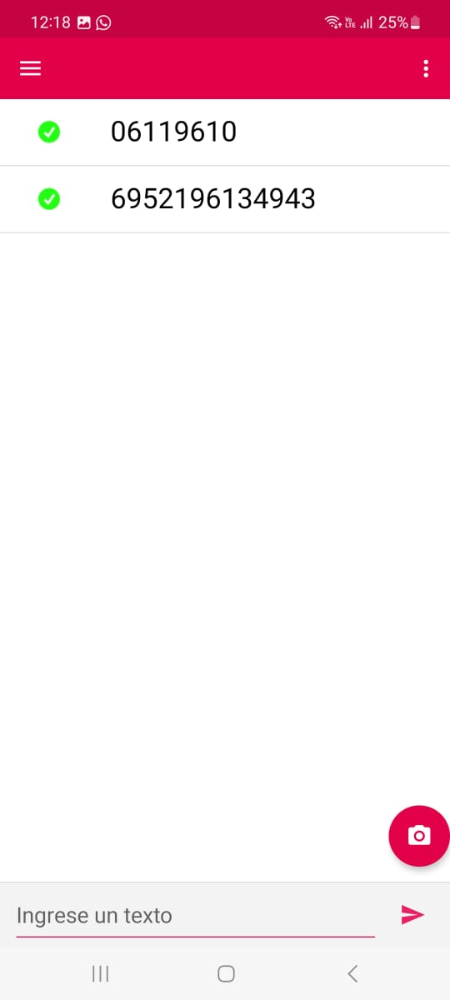
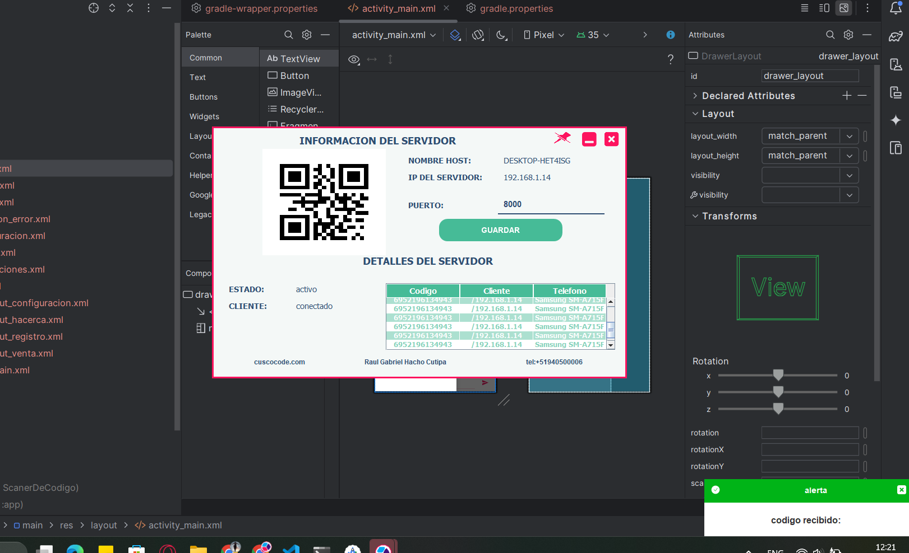
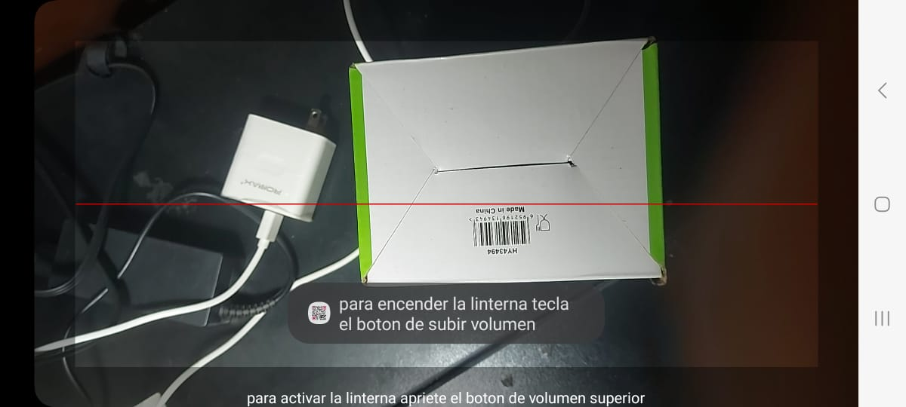
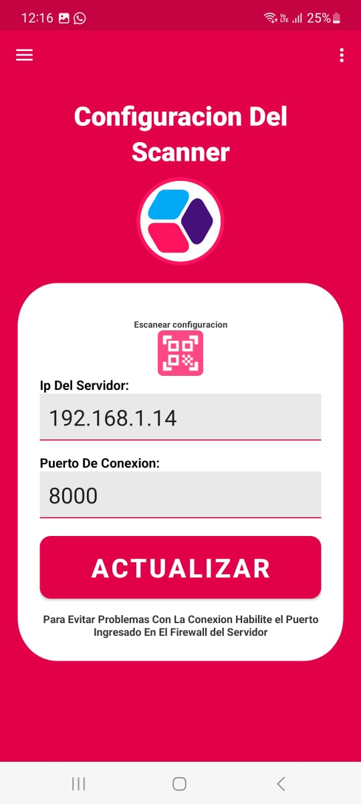
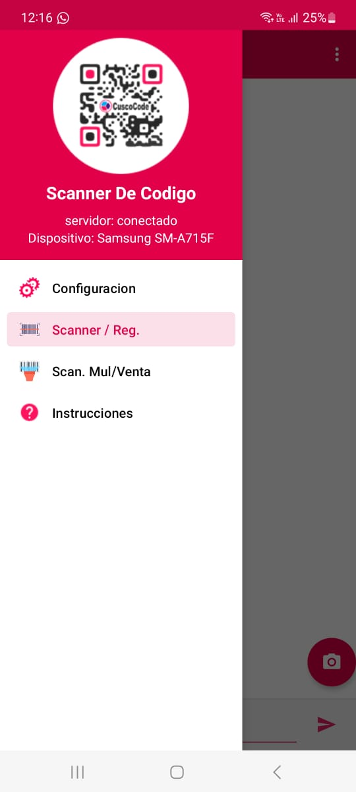
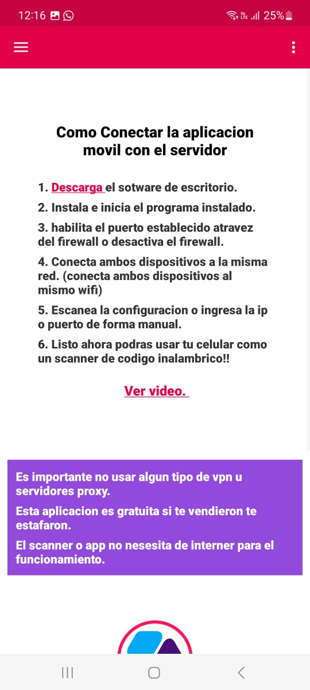

# Lector de Códigos de Barras Inalámbrico

Este proyecto consiste en un **lector de códigos de barras inalámbrico** desarrollado en **Java** para Android y PC. La app escanea códigos de barras con un dispositivo Android y envía los datos en tiempo real a una PC a través de una red Wi-Fi o cableada. Ideal para **sistemas de ventas (POS)** en negocios que buscan una alternativa económica y funcional a los escáneres comerciales.

## Requisitos

- **PC** con **Java** instalado para ejecutar el servidor (`servidor.jar`)
- **Dispositivo Android** para instalar la app
- Ambos dispositivos deben estar conectados a **la misma red Wi-Fi o cableada**

## Guía de Instalación y Uso

### 1. Ejecutar el Servidor en la PC

1. Asegúrate de tener **Java** instalado en la PC
2. Descarga el archivo `servidor.jar` y ejecútalo
   
4. Instalar la App en Android:
   - Descarga e instala la app en tu dispositivo Android
   - Conecta el móvil a la misma red que la PC

5. Conectar la App al Servidor
   - Abre la app y ve a Configuración
   - Escanea el QR que muestra el servidor en la PC
   - Guarda la configuración

6. Escanear Códigos
Usa la cámara para escanear códigos de barras

Los datos llegarán automáticamente a la PC

### Si hay errores de conexión:
   -Verifica que ambos dispositivos estén en la misma red
   -Revisa que el firewall no bloquee el puerto 8000
   -Reinicia ambas aplicaciones

### Notas Importantes
   -El servidor debe permanecer abierto durante el uso
   -La primera conexión puede demorar unos segundos
   -Para mejor rendimiento, usa conexión cableada en la PC

| Imagen 1 | Imagen 2 | Imagen 3 |
|----------|----------|----------|
|  |  |  |

| Imagen 4 | Imagen 5 | Imagen 6 |
|----------|----------|----------|
|  |  |  |

